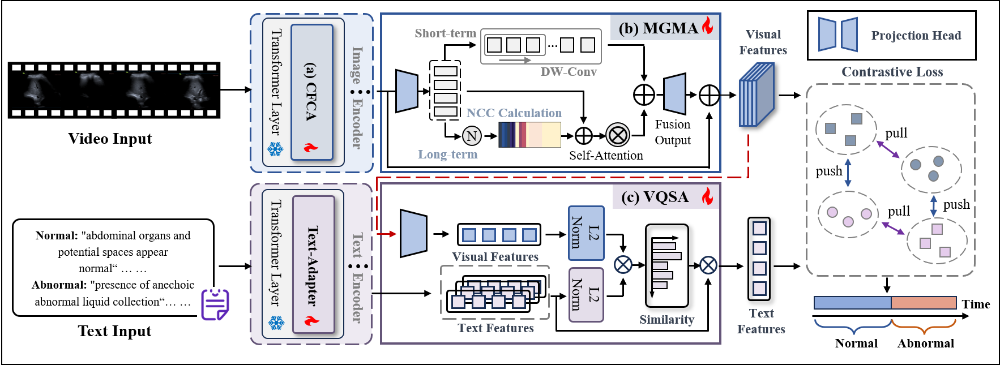

# TRUST: Efficient Image-to-Video Transfer for Video Analysis

<!-- 让图片居中，并限制宽度为 80% -->

  

## Abstract

Abdominal ultrasound is indispensable for rapid, noninvasive trauma triage. However, interpreting the subtle dynamic cues embedded in continuous scanning is time-intensive and operator-dependent. Parameter-Efficient Image-to-Video Transfer Learning (PEIVTL), which efficiently adapts pre-trained image models to the video domain, notably through visual–textual alignment, offers a promising paradigm for ultrasound video analysis. Nevertheless, substantial spatiotemporal and semantic variations arising from physician-dependent scanning practices continue to limit the effectiveness and generalizability of this framework. We propose TRUST, a scan-aware PEIVTL framework that explicitly models fine-grained spatiotemporal variations to enable reliable ultrasound video understanding. First, we introduce a Cross-Frequency Collaborative Adapter (CFCA) that establishes mutual constraints between low- and high-frequency components, enhancing discriminative spatial feature extraction under heavy speckle corruption. Second, we design a Multi-Granularity Motion-Aware (MGMA) module that integrates local temporal convolutions with motion-prior-guided global self-attention, jointly capturing stable intra-view patterns and abrupt inter-view transitions to characterize complex scanning dynamics. Third, a Visual Query Semantic Aggregation (VQSA) module dynamically generates text prototypes conditioned on visual features, enabling adaptive visual–textual alignment robust to intra-class variability under diverse scanning conditions. Experiments on in-house ultrasound trauma datasets demonstrate that TRUST outperforms state-of-the-art methods by 9.63\% with superior computational efficiency.

